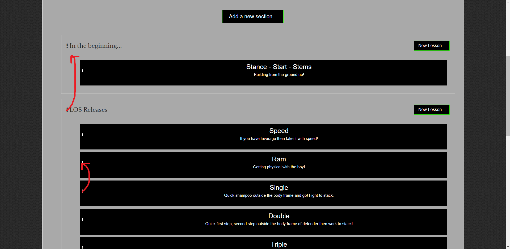
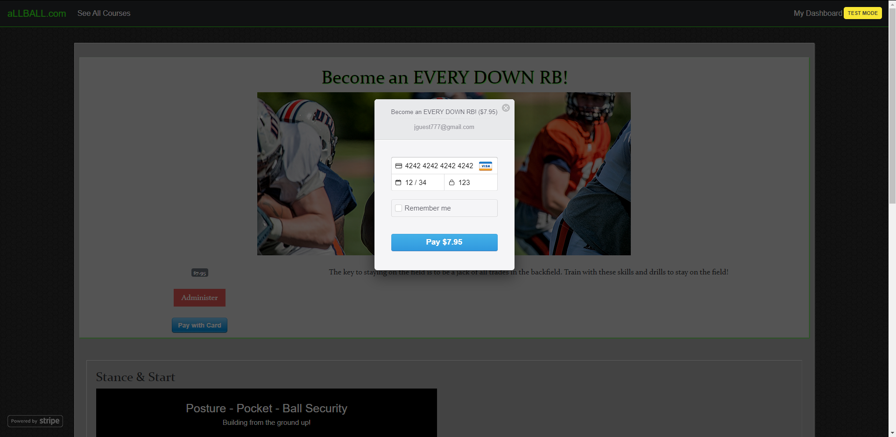
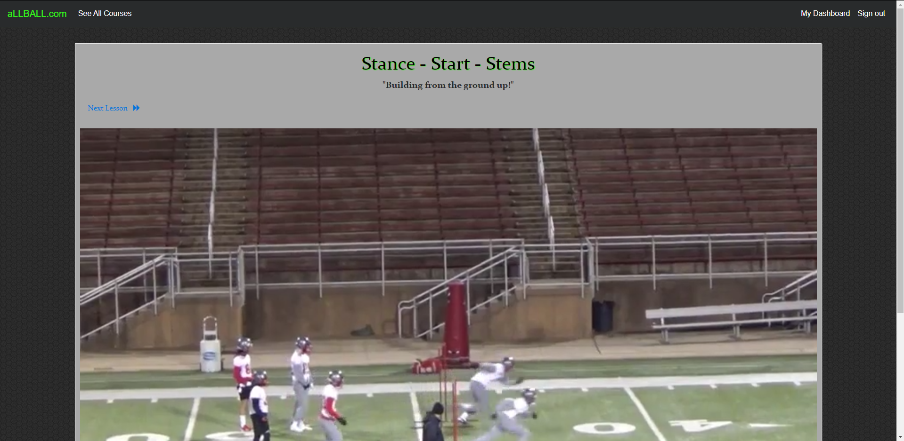

# aLLBALL

A two-sided, video-streaming marketplace platform that features credit card payment capabilities, user role management, complex user interfaces, and advanced database relationships.

## Database Architecture

Created five tables within a PostgreSQL database (courses, enrollments, lessons, sections & users).
  > A Course belongs to a User, and has many Sections and Enrollments.  
  > Enrollments belong to both a Course & a User.  
  > Lessons belong to a Section.  
  > Thus a Section belongs to a Course and also has many Lessons.  
  > Users will have many Courses, Enrollments and Enrolled Courses (keep track of courses the user is enrolled in).  

## RESTful Routing w/ CRUD actions

Created two branches of entry into a Course (Instructor & Student) using a namespace.  
  > This allows for two different views of the same Course (edit & read only) privledges.  
      &nbsp;&nbsp; /instructor/courses/1 (edit)  
      &nbsp;&nbsp; /courses/1 (read only)  
  > The ability to Enroll in a course is routed only through a Course.  
  > Both privledges react the same when navigating to Lessons & Sections.  

## Courses/Lessons

 

  > instructor can sort Lessons & Sections with Drag 'n Drop Functionality.

## Authentication/eCommerce

 

## Video Player

## Deployment

* [https://allball-app.herokuapp.com/](https://allball-app.herokuapp.com/)

## Tech

* [Ruby](https://www.ruby-lang.org/en/documentation/) v: 2.5.3
* [Rails](https://rubyonrails.org/) - v: 5.2.3
* [Bootstrap](https://getbootstrap.com/docs/4.4/getting-started/introduction/) - v: 4.0.0.alpha6
* [jQuery](https://jqueryui.com/download/) - v: jQuery-rails
* [postgreSQL](https://www.postgresql.org/) - Database
* [Heroku](https://devcenter.heroku.com/) - Deployment

## Built With
* [jQuery Sortable](https://jqueryui.com/sortable/) - Drag 'n Drop functionality
* [Stripe](https://stripe.com/docs) - Used for eCommerce capability
* [Carrierwave](https://github.com/carrierwaveuploader/carrierwave) - File uploads
