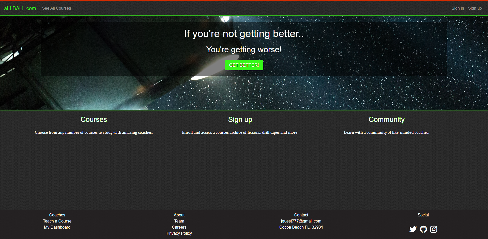
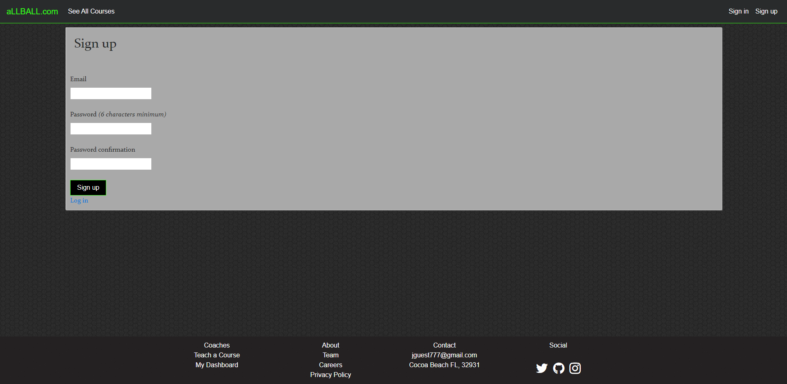
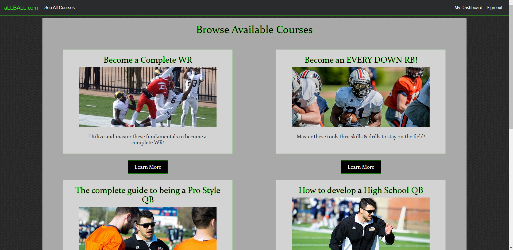

# aLLBALL

A two-sided, video-streaming marketplace platform that features credit card payment capabilities, user role management, complex user interfaces, and advanced database relationships.

 

## Getting Started

These instructions will get you a copy of the project up and running on your local machine for development and testing purposes.

## Deployment

https://allball-app.herokuapp.com/

## Built With

* [Stripe](https://stripe.com/docs) - Used for eCommerce capability
* [Carrierwave](https://github.com/carrierwaveuploader/carrierwave) - File uploads
